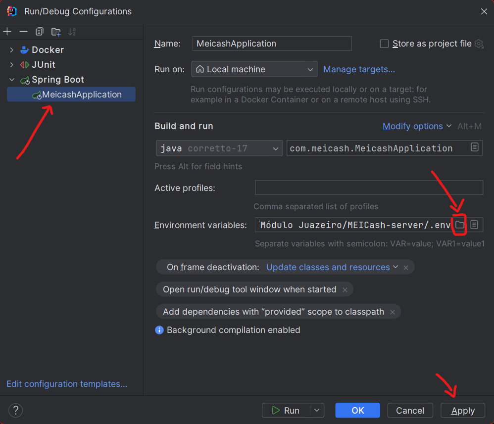

# MEICash-server


### Preparando o ambiente de desenvolvimento:

- Clone este repositório.
    ```bash
    git clone https://github.com/JonasFortes12/MEICash-server.git
    ```
- Abra o projeto usando o IntelliJ IDEA.
- Na raíz do projeto, crie um arquivo chamado `.env` e adicione as variáveis de ambiente disponíveis no arquivo `.env.example`.
    ```dotenv
    MEICASH_POSTGRES_HOST=host.docker.internal
    MEICASH_POSTGRES_PORT=5432
    MEICASH_POSTGRES_DB=juazeiro_meicash
    MEICASH_POSTGRES_USER=time_cinco
    MEICASH_POSTGRES_PASSWORD=pass_time_cinco

    # Change value to "never" for production environment
    MEICASH_SQL_INIT_MODE=always
    MEICASH_API_PORT=8080
    MEICASH_JWT_SECRET=mandacaru-jwt-secret
    
    # Integration test environment
    MEICASH_TEST_POSTGRES_HOST=127.0.0.1
    MEICASH_TEST_POSTGRES_PORT=5435
    MEICASH_TEST_POSTGRES_DB=mandacaru_broker_test
    MEICASH_TEST_POSTGRES_USER=time_cinco_test
    MEICASH_TEST_POSTGRES_PASSWORD=mandacaru
    ```
- Acesse, na barra superior da IDE `Run -> Edit Configuration`. 
Selecione `MEICashApplication` e clique no botão `Alt + E` para adicionar a configuração 
de variáveis de ambiente. Adicione as variáveis de ambiente disponíveis no arquivo `.env` criado. 

  

- Execute o banco de dados PostgreSQL usando Docker. Use o seguinte comando na raíz do projeto:
    ```bash
    docker-compose up -d
    ```
- Execute a aplicação Spring Boot. Click no botão de Play na parte superior direita da IDE.
- Você deve ser capaz de acessar o seguinte endereço: `http://localhost:8080/users` 
e ver a mensagem: `Eu retorno todos os usuários!`.
