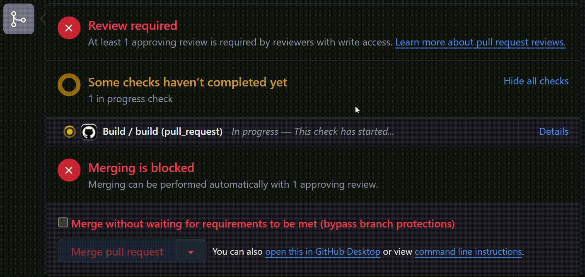

# MEICash-server

## Sobre o projeto:
O MEICash é um sistema de apoio à organização financeira de Micro Empreendedores Individuais (MEIs).

O planejamento deste projeto foi realizado em três etapas principais:
 1. ✅ Pesquisa de mercado para identificar as principais soluções no segmento.
 2. ✅ Elaboração de épicos/iniciativas para descrever as principais demandas de potenciais clientes.
 3. ✅ Consulta a microempreendedores para entender suas reais necessidades e priorizar a lista de funcionalidades identificadas.

Com este planejamento, nossa equipe percebeu que uma das funcionalidades mais úteis e prioritárias para os MEIs é a capacidade de organizar suas transações de forma simples, facilitando a busca e cálculos importantes para o negócio. Dessa forma, a implementação deste MVP oferece aos usuários a possibilidade de cadastrar e fazer login no sistema, registrar suas transações de maneira simples e criar categorias personalizadas para cada transação, facilitando a visualização e a busca por essas informações.

>[!NOTE]
>
>Esta é o repositório da API Java Spring que fornece os serviços do sistema. Esses serviços são consumidos por uma interface amigável ao usuário, facilitando a organização financeira de seu negócio. Para mais detalhes acesse o repositório do Front-end da aplicação: [Front-end](https://github.com/JonasFortes12/MEICash-front-end).

## Arquitetura da aplicação

## Fluxo de Trabalho
O ambiente de desenvolvimento foi configurado com um banco de dados PostgreSQL
instanciado usando o Docker e Docker-Compose.

Para criar uma documentação abrangente do projeto, cada nova funcionalidade a ser implementada 
foi descrita no formato de BDD (Behavior Driven Development) Features em Issues do GitHub.
Para consulatar a lista de Issues concluídas, veja: [Issues](https://github.com/JonasFortes12/MEICash-server/issues?q=is%3Aissue+is%3Aclosed).
E para visualizar a implementação de cada Feature, veja a [lista de PR´s](https://github.com/JonasFortes12/MEICash-server/pulls?q=is%3Apr+is%3Aclosed). 

Foi implementada uma pipeline de integração e entrega contínua (CI/CD):
- Para cada Pull Request aberto, um script no GitHub Actions faz a verificação de Build da aplicação.

  
  
- E também, o merge para branch main só é permitido após o Build e a aprovação de um revisor.

  
  
- Após o merge, o GitHub Actions faz o deploy da aplicação em uma máquina virtual na Azure.

  

## Uso
 -  Para configurar o ambiente de desenvolvimento e executar o projeto localmente, acesse o [Tutorial](./tutorial.md).

## Tecnologias Usadas
 - Spring Boot
 - PostgreSQL
 - Json Web Token
 - Swagger OpenAPI

## Contribuições
Contribuições são bem vindas! 

## Equipe
|  <strong>Isac Andrade</strong> |  <strong>Jonas Fortes</strong> |  <strong>Luan Moraes</strong> |  <strong>Geovana Souza</strong> |  <strong>stefaneadna</strong> |
| :---------------------------------------------------------------------------------------------------: | :--------------------------------------------------------------------------------------------------------: | :------------------------------------------------------------------------------------------------------: | :------------------------------------------------------------------------------------------------------: | :-----------------------------------------------------------------------------------------------------: |
| [LinkedIn](https://www.linkedin.com/in/isac-andrade-8915a5284/) | [LinkedIn](https://www.linkedin.com/in/jonas-fortes-2138731a3/) | [LinkedIn](https://www.linkedin.com/in/luansilvamoraes/) | [LinkedIn](https://www.linkedin.com/in/geovana-rodrigues-/) | [LinkedIn](https://www.linkedin.com/in/stefaneadna/) |
| [GitHub](https://github.com/IsacAnd) | [GitHub](https://github.com/JonasFortes12) | [GitHub](https://github.com/luanmooraes) | [GitHub](https://github.com/Geovanarsouza) | [GitHub](https://github.com/stefaneadna) |

